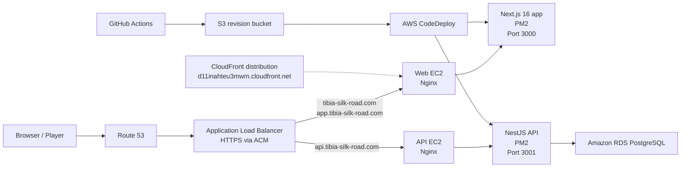

<p align="center">
  
</p>

<h1 align="center">Tibia Silk Road</h1>

<p align="center">
  An unofficial Tibia trading assistant focused on NPC arbitrage, bulk profit simulation, carrying-capacity planning, and fast access to item, NPC, and offer data.
</p>

<p align="center">
  <a href="https://tibia-silk-road.com/">Primary Frontend</a>
  &nbsp;|&nbsp;
  <a href="https://app.tibia-silk-road.com/">App Subdomain</a>
  &nbsp;|&nbsp;
  <a href="https://api.tibia-silk-road.com/docs#">API Docs</a>
  &nbsp;|&nbsp;
  <a href="https://d11inahteu3mwm.cloudfront.net/">CloudFront DNS</a>
</p>

---

## Overview

Tibia Silk Road is a full-stack web platform built to evaluate the economic and logistical viability of reselling Tibia items to NPCs. It combines a production web frontend, a production REST API, PostgreSQL-backed trade data, and an AWS-based deployment pipeline.

The repository contains the current production monorepo, supporting SQL/database assets, AWS-related static resources, and an older proof-of-concept application preserved for reference.

At a high level, the platform helps answer questions like:

- Which NPC pays best for a given item?
- Is buying this item on the market and reselling it to an NPC actually profitable?
- How much profit does the trade generate after fees?
- How much weight will the haul add, and how many trips are required?
- Where is Rashid right now, and how does that affect resale logistics?

---

## Production Status

The production environment is live and fully wired end to end.

- Web deployment is automated through GitHub Actions plus AWS CodeDeploy.
- API deployment is automated through GitHub Actions plus AWS CodeDeploy.
- Both services are live behind Nginx.
- Route 53, ACM, and ALB host-based HTTPS routing are in place.
- The frontend is loading real data from the API.
- Swagger documentation is publicly reachable.
- Database-backed endpoints are working in production.

### Public Endpoints

| Surface | URL | Notes |
| --- | --- | --- |
| Main frontend | [https://tibia-silk-road.com/](https://tibia-silk-road.com/) | Primary production entrypoint |
| Frontend alias | [https://app.tibia-silk-road.com/](https://app.tibia-silk-road.com/) | Alternate app hostname |
| API docs | [https://api.tibia-silk-road.com/docs#](https://api.tibia-silk-road.com/docs#) | Public Swagger UI |
| CloudFront distribution | [https://d11inahteu3mwm.cloudfront.net/](https://d11inahteu3mwm.cloudfront.net/) | Raw CloudFront DNS / edge distribution hostname |

> The custom domains above are the canonical production entrypoints. The CloudFront hostname is useful as a direct AWS distribution endpoint for validation and edge-level access.

---

## What the Platform Includes

### Frontend Capabilities

- Item search with dropdown selection
- NPC and faction filtering
- Profit calculation for market-to-NPC resale
- Break-even price calculation
- Bulk trade cart aggregation
- Capacity and backpack simulation
- Profit-per-weight analysis
- Rashid tracker with timezone-aware rotation logic
- Dark/light theming
- Internationalization support

### Backend Capabilities

- REST endpoints for items, NPCs, and offers
- Swagger/OpenAPI documentation
- PostgreSQL-backed data access through Prisma
- CORS protection
- Request throttling / rate limiting
- Unit and E2E test coverage

### Core Business Entities

| Entity | Description |
| --- | --- |
| Items | Tibia items with metadata such as weight, type, icons, and task-deliverable status |
| NPCs | Buyer NPCs, including quest requirements and icon metadata |
| Offers | Buy-price relations connecting items and NPCs |

---

## Repository Layout

```text
.
|-- .github/                 # GitHub Actions workflows
|-- aws/                     # AWS-related static bucket contents and assets
|-- database/                # SQL setup and seed scripts
|-- poc/                     # Earlier prototype kept for reference
|-- scripts/                 # Utility scripts
|-- turborepo/               # Active production monorepo
|   |-- apps/
|   |   |-- api/             # NestJS + Prisma backend
|   |   `-- web/             # Next.js frontend
|   `-- packages/
|       |-- eslint-config/
|       |-- typescript-config/
|       `-- ui/
`-- README.md                # This file
```

### Monorepo Packages

| Path | Role |
| --- | --- |
| `turborepo/apps/web` | Production frontend built with Next.js 16 and React 19 |
| `turborepo/apps/api` | Production backend built with NestJS and Prisma |
| `turborepo/packages/ui` | Shared UI package |
| `turborepo/packages/eslint-config` | Shared lint rules |
| `turborepo/packages/typescript-config` | Shared TypeScript presets |
| `database/` | Versioned SQL scripts used to create and evolve the dataset |
| `aws/s3_bucket/` | Static files and icon assets prepared for AWS-hosted delivery |
| `poc/` | Legacy proof-of-concept implementation |

---

## Technology Stack

### Web

- Next.js 16 (App Router)
- React 19
- TypeScript
- CSS variables plus component-level inline styling
- TailwindCSS for global baseline support
- Vitest plus React Testing Library

### API

- NestJS 11
- Prisma 7 with `@prisma/adapter-pg`
- PostgreSQL
- Swagger / OpenAPI
- Jest plus Supertest
- Testcontainers for E2E validation

### Platform / Tooling

- pnpm workspaces
- Turborepo
- ESLint
- Prettier
- PM2
- Nginx
- GitHub Actions
- AWS CodeDeploy
- Amazon EC2
- Amazon RDS
- Amazon Route 53
- AWS Certificate Manager (ACM)
- Application Load Balancer (ALB)
- Amazon CloudFront

---

## Architecture

The production topology is centered around host-based routing through an HTTPS load balancer, with separate web and API runtimes behind Nginx and a PostgreSQL database behind the API.



### Request Flow

1. The browser resolves the domain through Route 53.
2. TLS is terminated at the ALB using an ACM-issued certificate.
3. Host-based rules route traffic to either the web target group or the API target group.
4. Nginx on each EC2 instance proxies traffic to the process managed by PM2.
5. The API reads from PostgreSQL on Amazon RDS and returns the normalized trade data consumed by the frontend.

### Host Routing

| Host | Destination |
| --- | --- |
| `tibia-silk-road.com` | Web frontend |
| `app.tibia-silk-road.com` | Web frontend |
| `api.tibia-silk-road.com` | API backend |

---

## Deployment Model

Both production applications are deployed independently from GitHub Actions.

### Web Deployment

Workflow: `.github/workflows/deploy-web.yml`

Main steps:

1. Install workspace dependencies with pnpm.
2. Run lint, typecheck, and tests for the web app.
3. Inject the production API URL into `apps/web/.env.production`.
4. Build the Next.js application.
5. Package the runtime artifact, public assets, deployment scripts, and PM2 config.
6. Upload the revision bundle to S3.
7. Trigger AWS CodeDeploy for the web deployment group.

### API Deployment

Workflow: `.github/workflows/deploy-api.yml`

Main steps:

1. Install workspace dependencies with pnpm.
2. Run lint, typecheck, and tests for the API app.
3. Inject the production runtime environment into `apps/api/.env`.
4. Build the NestJS application.
5. Package the compiled output, Prisma assets, deployment scripts, and PM2 config.
6. Upload the revision bundle to S3.
7. Trigger AWS CodeDeploy for the API deployment group.

### Runtime Supervision

Both services are managed by PM2 in production:

- Web process name: `tsr-web`
- API process name: `tsr-api`

Nginx sits in front of both processes on their EC2 hosts and acts as the local reverse proxy layer.

---

## AWS Infrastructure Notes

This repository is not only an application codebase; it also reflects the surrounding production architecture.

### Confirmed Production Pieces

- Route 53 for public DNS
- ACM for HTTPS certificate management
- ALB for host-based HTTPS routing
- EC2 instances for isolated web and API runtimes
- Nginx on both instances
- PM2 for process lifecycle management
- RDS PostgreSQL for persistent data
- GitHub Actions plus CodeDeploy for automated releases

### CloudFront

A CloudFront distribution hostname is also available at:

- [https://d11inahteu3mwm.cloudfront.net/](https://d11inahteu3mwm.cloudfront.net/)

This is useful for:

- validating raw AWS distribution behavior
- checking edge/caching behavior independently of the custom domains
- confirming distribution reachability during rollout or DNS work

The main public experience, however, should be considered the custom-domain deployment served through the production DNS entries.

---

## Local Development

### Requirements

- Node.js 20+ recommended
- pnpm 9+
- Docker for API E2E tests
- PostgreSQL for local API development, unless using containerized test flows

### Workspace Setup

```bash
git clone <your-fork-or-remote>
cd tibia-silk-road/turborepo
pnpm install
```

### Run the API

```bash
pnpm --filter api dev
```

Local API:

- `http://localhost:3001`
- `http://localhost:3001/docs`

### Run the Web App

```bash
pnpm --filter web dev
```

Local frontend:

- `http://localhost:3000`

### Common Workspace Commands

```bash
pnpm build
pnpm lint
pnpm check-types
```

### App-Specific Validation

```bash
pnpm --filter web test:run
pnpm --filter api test:run
pnpm --filter api test:e2e
```

---

## Environment Overview

### Web

The web app expects a production API URL during deployment and uses environment-driven configuration to point the frontend to the backend.

Relevant production workflow input:

- `WEB_API_URL` GitHub secret

### API

The API requires runtime values such as:

- `DATABASE_URL`
- `ALLOWED_ORIGIN`
- `PORT`
- `NODE_ENV`

Relevant production workflow input:

- `API_ENV_PRODUCTION` GitHub secret

For the exact local-development expectations, see the app-level READMEs:

- `turborepo/apps/web/README.md`
- `turborepo/apps/api/README.md`

---

## Data and Database Assets

The repository includes a dedicated `database/` directory with versioned SQL files that cover schema creation, seed data, and subsequent adjustments to the domain model.

Examples include:

- role/database creation
- table creation
- initial seed data
- schema expansion for weekday and NPC icons
- trade-data seeding
- deliverable and weight updates

The API itself uses Prisma as the runtime data-access layer, while the repository preserves raw SQL assets for broader project and infrastructure workflows.

---

## Additional Repository Areas

### `aws/`

Contains AWS-related static content, including a large collection of item and NPC icon assets prepared for bucket-based hosting and delivery.

### `poc/`

Contains an earlier proof-of-concept implementation built before the current production monorepo architecture settled around Next.js plus NestJS. It remains useful for historical reference, design comparison, and experimentation.

---

## Why This Repository Matters

This is not just a small frontend for a school project. In its current form, the repository documents and powers a real deployed full-stack system with:

- a public production frontend
- a public API documentation surface
- automated CI/CD
- a dedicated AWS hosting architecture
- a normalized trade dataset
- domain-specific calculation logic for Tibia resale planning

It is both a product repository and an operational record of how the platform is built, tested, shipped, and hosted.

---

## Disclaimer

Tibia is a trademark and product of CipSoft GmbH. This repository is an unofficial fan-made utility and is not affiliated with, endorsed by, or maintained by CipSoft.

