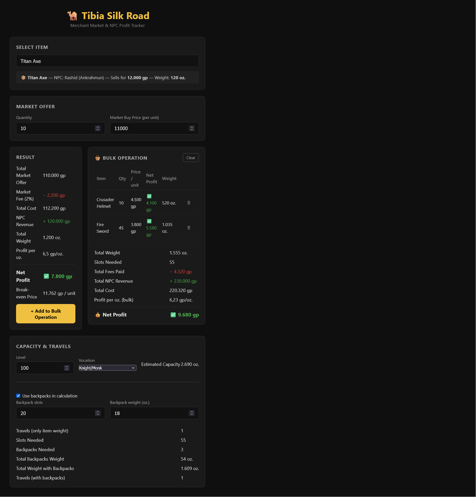

# Tibia Silk Road


A proof of concept for evaluating **Tibia market arbitrage** opportunities by comparing market buy prices against NPC sell values. The app helps players decide whether an offer is worth taking based on net profit, profit density (`gp/oz.`), bulk weight, backpack overhead, and estimated number of travels.

---

## Table of Contents

- [Overview](#overview)
- [Features](#features)
- [Tech Stack](#tech-stack)
- [Screenshots](#screenshots)
- [How It Works](#how-it-works)
- [Project Structure](#project-structure)
- [Getting Started](#getting-started)
- [Available Scripts](#available-scripts)
- [Data Model](#data-model)
- [Roadmap](#roadmap)
- [License](#license)

## Overview

**Tibia Silk Road** was created as a lightweight decision-support tool for Tibia players who buy items from the Market and sell them to NPCs for profit.

Instead of manually checking offers item by item, the application centralizes the most relevant trading metrics in one place:

- Market cost.
- NPC revenue.
- Net profit.
- Profit per ounce (`gp/oz.`).
- Total item weight.
- Slots needed.
- Backpack amount and total backpack weight.
- Estimated travels required based on character capacity.

The project is intentionally simple and focused on fast feedback, clear UI, and practical calculations.

## Features

### Single item analysis

- Search items by name.
- View NPC buyer and city.
- View NPC price and item weight.
- Enter quantity and market buy price.
- Calculate total market offer.
- Calculate Tibia market fee.
- Calculate total operation cost.
- Calculate NPC revenue.
- Calculate net profit.
- Calculate break-even price.
- Calculate profit per ounce (`gp/oz.`).

### Bulk operation

- Add multiple item calculations into a bulk list.
- Aggregate total profit, fees, revenue, cost, and weight.
- Show total slots needed for all selected items.
- Show total backpacks needed.
- Show total backpack weight.
- Estimate number of travels with and without backpack overhead.

### Capacity estimation

- Estimate character capacity using level and vocation.
- Support these vocation options:
  - Knight/Monk
  - Paladin
  - Sorcerer/Druid
  - Rookstayer

## Tech Stack

### Frontend

- **React** for UI rendering.
- **TypeScript** for type safety.
- **Vite** for local development and production build.
- **CSS** for styling.

### Data

- Local JSON dataset for item and NPC offer entries.

### Planned backend/database evolution

- **PostgreSQL** for persistent storage.
- **AWS RDS** for managed database hosting.
- Separation of entities into:
  - `items`
  - `npcs`
  - `offers`

## Screenshots

### In Use



## How It Works

### 1. Item selection

The user searches for an item and selects an available NPC offer entry.

### 2. Market input

The user enters:

- Quantity.
- Market buy price per unit.

### 3. Profit calculation

The app computes:

- Total Market Offer.
- Market Fee.
- Total Cost.
- NPC Revenue.
- Net Profit.
- Break-even Price.
- Total Weight.
- Profit per ounce (`gp/oz.`).

### 4. Bulk aggregation

The user can add the result into the Bulk Operation panel, where multiple item entries are summed.

### 5. Travel estimation

Based on character level, vocation, backpack slots, and backpack weight, the app estimates:

- Slots needed.
- Backpacks needed.
- Total backpack weight.
- Total weight with backpacks.
- Estimated number of travels.

## Project Structure

```bash
.
├── public/
├── src/
│   ├── App.tsx
│   ├── App.css
│   ├── items.json
│   ├── main.tsx
│   └── ...
├── package.json
├── tsconfig.json
├── vite.config.ts
└── README.md
```

## Getting Started

### Prerequisites

Make sure you have installed:

- Node.js 18 or newer.
- npm.

### Installation

Clone the repository:

```bash
git clone <your-repository-url>
cd <your-project-folder>
```

Install dependencies:

```bash
npm install
```

### Run locally

Start the development server:

```bash
npm run dev
```

Then open the URL shown in the terminal, usually:

```bash
http://localhost:5173
```

## Available Scripts

```bash
npm run dev
npm run build
npm run preview
```

## Data Model

The current POC uses a single local simplified JSON file with entries shaped like this:

```json
{
  "id": 1,
  "name": "Crusader Helmet",
  "weight": 52.0,
  "npcPrice": 5000,
  "npcName": "Rashid",
  "npcCity": "Ankrahmun"
}
```

## Example Use Case

1. Search for `Fire Sword`.
2. Select an NPC entry.
3. Enter quantity and market buy price.
4. Review net profit and `gp/oz.`.
5. Add the operation to the bulk list.
6. Add more items.
7. Fill in capacity and backpack information.
8. Check how many travels the full operation requires.

## Why `gp/oz.` matters

In this project, `gp/oz.` is one of the most important decision metrics because it measures how much profit each ounce of carrying capacity generates.

A high-profit item is not always a good trade if it is too heavy. By combining total profit with weight, `gp/oz.` gives a better benchmark for comparing opportunities under capacity constraints.

## Roadmap

- Connect the frontend to a real backend API.
- Replace static JSON with PostgreSQL data.
- Model data using normalized entities.
- Add filters by NPC, city, and item type.
- Add sorting by profit, `gp/oz.`, and weight.
- Add real screenshots and demo GIFs.
- Add deployment documentation.
- Add CI/CD badges once pipeline is configured.

## License

This project is available under the **MIT License**.

If you use a different license, replace this section accordingly.

## Author

Built as a proof of concept for full stack learning, Tibia market analysis, and practical trade optimization.

## Notes

This documentation was drafted with AI assistance and reviewed, edited, and validated by the author.
